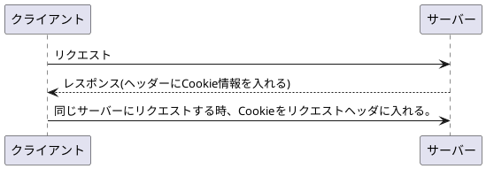
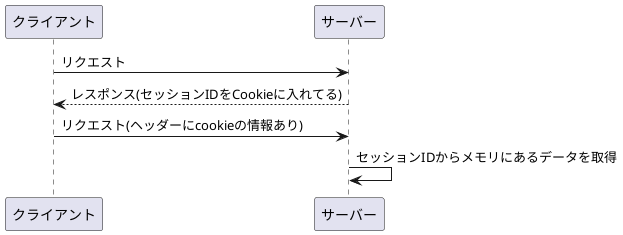

# HTTPはステートレスなプロトコル

Cookie, Sessionの説明に入る前に、まずHTTPの特徴について説明。

HTTPは、リクエストに対して、レスポンスを返すやりとりを繰り返すだけ。
HTTPプロトコル自体に、状態を持つ仕組みは存在しない。

そのため、HTTPはステートレス・プロトコルと呼ばれている。

ただし、ユーザーログイン画面など、状態を保持したい場合がある。
そんな場合に対応するために考えられたのが、Cookieという仕組み。

## Cookie

CookieはHTTPの仕様を拡張してWebアプリケーションとWebブラウザの間で情報を交換できるようにしたもの。
CookieはHTTPレスポンスヘッダに情報として送られる。

ただし、ユーザー名やパスワードをCookieで保存することはセキュリティ上大きな問題となる。そのため、安全に情報を保持するために生まれたのが、Sessionという仕組み。

Cookieを受け取った後でも、異なるwebサーバに対しては、Cookieを送らない。

## Session

セッションIDというものを使う。セッションIDは、Webサーバーにリクエストを発行したクライアントを識別するためのもの。

セッションはセッションIDをHTTPレスポンスのCookieへ格納してクライアントへ渡します。

HTTPリクエストでCookieにセッションIDを入れて送った場合、サーバ側でセッションIDから、そのセッションIDに紐づいた情報を取得して、クライアントを識別することができる。

結局のところ、Cookieを使ってやりとりをするが、Cookieの中に情報そのものを格納するのか、セッションIDだけを格納するのかが大きな違い。

