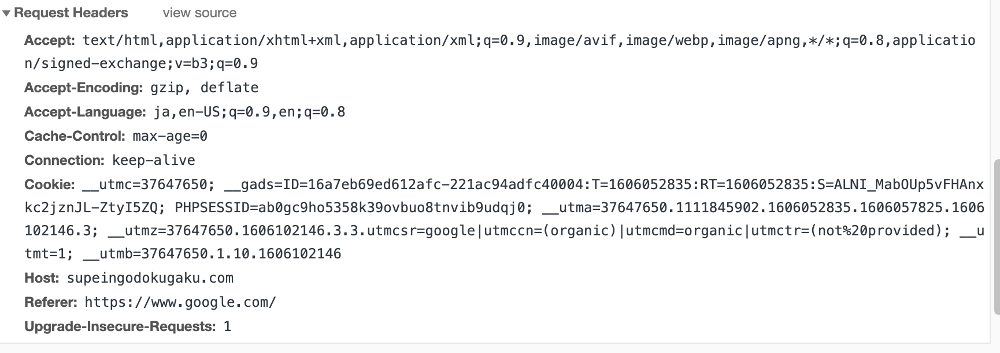
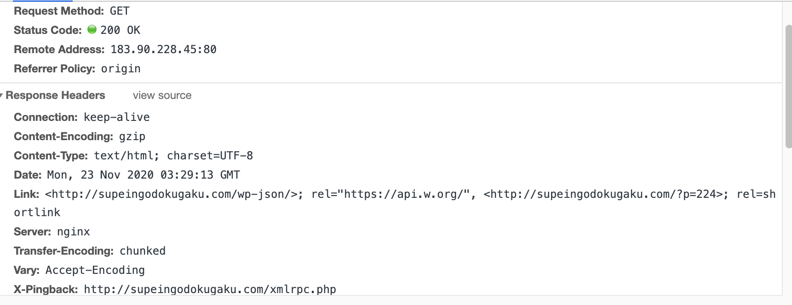

# HTTPとは

HTTPとは、WWWの正解でHTMLをやりとりするために定められたプロトコルが「HTTP(Hyper Text Transfer Protocol)」だった。

ここでは、スペイン語中毒部を例に説明する。

## HTTPリクエスト

HTTPリクエストはリクエストライン、メッセージヘッダから成り立つ。

```
GET shttp://supeingodokugaku.com/manseisupeingocyudoku/ HTTP/1.1
```

メッセージヘッダとはリクエストの付加的情報を表す場所のこと。

ヘッダの意味を簡単に整理

* Accept・・・Webクライアントが受け取ることのできるデータの種類を表したもの。
* Accept-Language・・・webクライアントが受け取ることのできる、自然言語の種類を示します。自然言語とは、人間が使用する言語のことです。
* User-Agent・・・利用しているWebブラウザの種類やバージョンを示します。Webサーバがアクセスしてきたクライアントの種類に応じて適切なコンテンツを返すために利用されています。具体的な例として、PCとスマホの両方から閲覧できるサイトがあります。



## HTTPレスポンス



ステータスコード

|ステータスコード|意味|説明|
|---|---|---|
|1xx|informational(情報)|リクエストの処理が継続していることを示す|
|2xx|success(成功)|リクエストが成功したことを示す|
|3xx|redirection(リダイレクション)|リクエストを完了するにはさらに動作が必要であることを示す|
|4xx|client error(クライアントエラー)|クライアント側に起因するエラーのため、リクエストが失敗したことを示す|
|5xx|server error(サーバーエラー)|サーバー側に起因するエラーのため、リクエストが失敗したことを示す|

|ステータスコード|意味|説明|
|---|---|---|
|200|OK|リクエストが正常に完了したことを示す|
|201|Created|リクエストが正常に完了したことを示す(レスポンスボディなし)|
|302|Found|リクエストされたリソースが一時的に別のURIに属していることを示す。リダイレクト時に利用される|
|400|Bad Request|構文が無効であり、サーバーがリクエストを理解できないことを示す。|
|401|Unauthorized|ユーザー認証に失敗したことを表す|
|403|Forbidden|アクセス権限がないため、サーバーにリクエストの実行を拒否されたことを示す|
|404|Not Found|リクエストURIに一致するリソースを見つけられなかったことを表す。|
|500|Internal server error|サーバー側に起因するエラーのこと|
|503|Service Temporarily Unavailable|サーバーエラーレスポンスコードで、サーバーがリクエストを処理する準備ができていないことを示す。一般的な原因は、サーバーがメンテナンス中のために停止していることや、過負荷状態になっていること。|

メソッドの種類について後ほどまとめる。

# 情報はどうやってインターネットを通じて送られるのか

## IPアドレス

HTTPリクエストでは、リクエスト先のWebサーバーはURLの中のホスト名の部分で表されていました。「http://supeingodokugaku.com」が要求先のwebサーバーを示しています。しかし、このホスト名も人間にわかりやすいように表現されているにすぎません。実際のところ、インターネットに接続された全てのコンピュータは「IPアドレス」という数値によって識別されています。

IPアドレスが分かると、宛先のホストが特定できるので、そのホストへ任意の情報を届けることができます。インターネットの世界でその役割を担うのが「TCP/IP」と呼ばれるプロトコルです。

TCP/IPはブラウザなどから受け取ったHTTPリクエストなどの情報をパケットと呼ばれる小さな単位に分割して送信し、受け取った側でそれらを元のように組み立ててから受け手となるWebサーバーなどのアプリケーションへ渡しています。

上記のまとめとして、重要なことは以下の２点となります。

* 情報はパケットと呼ばれる単位に分割されて送受信されている。
* パケットの送受信はTCP/IPが責任を持って行っている。

IPアドレスは世界中で唯一の値とならないといけないから、勝手には決められません。IPアドレスもドメインと同じように特定の団体（ICANNという団体）が管理しており、ここへ申請しなければIPアドレスを割り当ててもらえません。しかし、例えば個人で家で利用する場合、私たちが利用するインターネットサービスプロバイダがまとまった数のIPアドレスを確保しています。私たちがインターネットへ接続するたびに、ISPが確保しているIPアドレスのうち１つを一時的に割り当てられる仕組みになっています。

このようにして割り当てられたIPアドレスはインターネット上で唯一のアドレスとなり、グローバルIPアドレスと呼ばれます。逆に、インターネットを利用していない機器でも、オフィス内や家庭内でネットワークを構築するためには、それぞれの機器にIPアドレスが必要となります。このように、インターネットなどほかのネットワークに接続されていないネットワークのことをプライベートネットワークといいます。プライベートネットワーク上では、プライベートIPアドレスが用いられます。これは、ある一定範囲のIPアドレスをプライベートネットワークで自由に利用できるよう予約したものです。

例えるなら、電話番号と内線番号みたいなものです。

プライベートアドレスは、３種類の範囲が用意されています。

|プライベートIPアドレス|クラス|利用可能な範囲|
|---|---|---|
|10.0.0.0 ~ 10.255.255.255|クラスA|16777216個|
|172.168.0.0 ~ 172.31.255.255|クラスB|1048576個|
|192.168.0.0 ~ 192.168.255.255|クラスC|65536個|

## DNS

ドメイン名からIPアドレスに変換する仕組みが、DNS。DNSは、ドメイン名とIPアドレスの対応表を持ったコンピュータをインターネット上に配置しておき、DNSサーバーへ問合せればドメイン名に対応するIPアドレスを教えてもらえるというものです。


DNSサーバーは多数用意されており、情報を分散管理しています。例えば、gihyo.jpというドメイン名はgihyo, jpと２つの階層に分かれています。インターネット上には各階層に対応するDNSサーバーが用意されており、それらのDNSサーバーに問い合わせることで、下位のDNSサーバーのアドレスを知ることができるようになっています。

jpやcom, net, orgといった最上位のドメインを「トップレベルドメイン(TLD)」と呼びますが、これらTLDのDNSサーバーを管理する大元締めとも言えるDNSサーバが存在します。それが「ルートサーバー」です。


## port

インターネットの世界ではHTTP以外にもさまざまなプロトコルで情報がやりとりされています。電子メールの送受信であるSMTPやPOP3、ファイル転送を行うためのFTP、リモートでコンピュータを操作するためのTelnetやSSHなどが挙げられます。これらのプロトコルは全て、TCP/IPの上に成り立っており、宛先のコンピュータを指定するのにIPアドレスを使用しています。

受信した情報がどのようなプロトコルであり、どのようなアプリケーションで処理すべきかどうかはTCP/IPにはわからないため、Portという考え方が必要になります。

よく使われるプロトコルについては標準で使用するポートが取り決められています。
そのような代表的なプロトコルで使用されるポートは「well known ports」と呼ばれています。

|ポート番号|プロトコル|
|---|---|
|20, 21|FTP|
|22|SSH|
|23|Telnet|
|25|SMTP|
|53|DNS(ホスト名解決)|
|80|HTTP|
|110|POP3(メール受信)|
|443|HTTPS|
